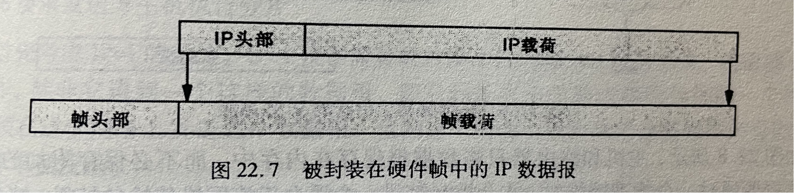

### 计算机网络第二次作业 (计算机网络与因特网 第六版 英文)
#### 2151299 苏家铭
---

#### **21.8 编写一个计算机程序，在 CIDR 斜杠表示法和等效的点分十进制值之间进行转换。**
```
import ipaddress

def cidr_to_dotted_decimal(cidr_notation):
    # Parse CIDR notation
    network = ipaddress.ip_network(cidr_notation, strict=False)
    
    # Get the dotted decimal representation of the network address
    network_address = str(network.network_address)
    
    return network_address

def dotted_decimal_to_cidr(dotted_decimal):
    # Parse the dotted decimal representation
    network = ipaddress.IPv4Network(dotted_decimal, strict=False)
    
    # Get the CIDR notation of the network
    cidr_notation = str(network)
    
    return cidr_notation

# Example usage:
cidr_notation = "192.168.1.0/24"
dotted_decimal_value = cidr_to_dotted_decimal(cidr_notation)
print(f"CIDR to Dotted Decimal: {cidr_notation} -> {dotted_decimal_value}")

dotted_decimal_value = "192.168.1.0"
cidr_notation = dotted_decimal_to_cidr(dotted_decimal_value)
print(f"Dotted Decimal to CIDR: {dotted_decimal_value} -> {cidr_notation}")

```
该程序使用Python中的ipaddress模块来处理IPv4地址的CIDR表示法和点分十进制格式之间的转换。

#### **21.13 假设你是一个拥有/22 IPv4地址块的ISP。你能否满足以下6个客户的地址申请请求，他们分别需要为9、15、20、41、128和260台计算机申请地址？如果可以，如何分配地址？如果不可以，那又是为什么？**
可以。

1. 客户1（需要9个地址）：可以分配一个/28子网，提供16个IP地址。
2. 客户2（需要15个地址）：可以分配一个/27子网，提供32个IP地址。
3. 客户3（需要20个地址）：可以分配一个/27子网，提供32个IP地址。
4. 客户4（需要41个地址）：可以分配一个/26子网，提供64个IP地址。
5. 客户5（需要128个地址）：可以分配一个/24子网，提供256个IP地址。
6. 客户6（需要260个地址）：可以分配一个/23子网，提供512个IP地址。

分配方案如下：

1. 客户6：分配 `X.X.X.0/23`（可用地址：`X.X.X.1` 到 `X.X.X.510`）
2. 客户5：分配 `X.X.X.512/24`（可用地址：`X.X.X.513` 到 `X.X.X.766`）
3. 客户4：分配 `X.X.X.768/26`（可用地址：`X.X.X.769` 到 `X.X.X.830`）
4. 客户3：分配 `X.X.X.832/27`（可用地址：`X.X.X.833` 到 `X.X.X.862`）
5.  客户2：分配 `X.X.X.864/27`（可用地址：`X.X.X.865` 到 `X.X.X.894`）
6.  客户1：分配 `X.X.X.896/28`（可用地址：`X.X.X.897` 到 `X.X.X.910`）

这个分配方案保证了每个客户都有足够的IP地址来满足他们的需求。


#### **21.14 假设你是一个拥有/22 IPv4地址块的ISP。需要向4个客户分配地址块，每个都需要为60台计算机申请地址。请给出你的CIDR分配方案。**

每个/22地址块有1024个IP地址，其中1022个用于主机。在这个情况下，需要为4个客户分配地址块，每个需要为60台计算机申请地址。考虑到每个客户的需求，我们可以为每个客户分配一个/26地址块，因为/26提供64个IP地址，足够满足每个客户60台计算机的需求。

具体的CIDR分配如下：

1. 客户1：分配 `X.X.X.0/26`
   - 可用地址范围：`X.X.X.1` 到 `X.X.X.62`（总共62个地址）

2. 客户2：分配 `X.X.X.64/26`
   - 可用地址范围：`X.X.X.65` 到 `X.X.X.126`（总共62个地址）

3. 客户3：分配 `X.X.X.128/26`
   - 可用地址范围：`X.X.X.129` 到 `X.X.X.190`（总共62个地址）

4. 客户4：分配 `X.X.X.192/26`
   - 可用地址范围：`X.X.X.193` 到 `X.X.X.254`（总共62个地址）

其中，`X.X.X`是/24地址块的前缀。每个客户的/26地址块提供了64个地址，其中62个用于主机，足够满足每个客户60台计算机的需求。


#### **22.1 设计者在设计网络时要考虑的两种基本通信服务形式是什么？**
在设计网络时，设计者通常要考虑两种基本通信服务形式：

1. **面向连接服务（Connection-oriented services）：**
   - 这种服务形式要求在通信的两端先建立一条连接，然后再进行数据传输。连接的建立包括一系列的握手过程，以确保通信的可靠性和有序性。
   - 提供连接导向型服务的典型协议包括传输控制协议（TCP）。TCP通过建立连接、数据传输和连接释放等步骤来保证可靠的数据传输。
   - 连接导向型服务适用于对数据传输可靠性要求较高的应用，如文件传输、电子邮件等。

2. **无连接服务（Connectionless services）：**
   - 这种服务形式不需要在通信的两端先建立连接，数据可以直接发送到目标，每个数据包都是独立的，不依赖于之前的数据包。
   - 提供无连接型服务的典型协议包括用户数据报协议（UDP）。UDP具有较低的开销，但不提供数据传输的可靠性和有序性。
   - 无连接型服务适用于对实时性要求较高，而对可靠性要求相对较低的应用，如实时音视频传输、在线游戏等。

在实际设计网络时，根据应用的需求和性质，设计者需要综合考虑连接导向型服务和无连接型服务的特点，选择合适的通信服务形式。有些应用可能需要使用混合模式，同时使用连接导向型和无连接型服务，以充分满足应用的各种要求。

22.11 假设两个路由器被错误配置，以至于对某个目的地D产生了闭合的路径环。解释一下为什么目的地为D的数据报不会永远地在这个路径中传送。

当两个路由器被错误配置，导致对某个目的地D产生了闭合的路径环时，数据报不会永远地在这个路径中传送，而是会遇到 TTL（Time to Live）的限制。以下是解释为什么这样发生的几个原因：

1. **TTL字段：**
   - 在IP协议中，每个数据报都包含一个TTL字段。TTL的目的是防止数据报在网络中无休止地循环。
   - 每经过一个路由器，TTL的值减1。如果TTL的值减为零，数据报将被丢弃，并且发送端会收到ICMP超时消息。
   - 当数据报在闭合的路径环中循环时，每次经过路径的一个循环，TTL都会减小，最终到达零，导致数据报被丢弃。

2. **循环检测机制：**
   - 许多路由器实现了循环检测机制，以便在检测到路径环时更早地丢弃数据报。这可以通过维护已经访问过的路由器列表或标记每个数据报上的路由器ID来实现。
   - 如果一个数据报到达一个已经在它的路径上的路由器，这个路由器可以检测到这个循环并立即丢弃数据报，而不是等到TTL减为零。

3. **路由器资源耗尽：**
   - 如果有一个闭合的路径环，数据报将在这个环中循环，占用网络资源，导致网络拥塞和资源耗尽。
   - 路由器通常具有有限的缓存和处理能力，而在一个无限循环中的数据报将一直占用这些资源，影响正常的网络通信。

因此，由于TTL的存在、循环检测机制和防止资源耗尽，目的地为D的数据报不会永远在一个闭合的路径环中传送，而是会在经过一定数量的路由器后被丢弃。这有助于防止网络中的无限循环，并保护网络资源免受不正确配置所导致的问题。

#### **22.13 IP数据报被放在帧的什么位置进行传输？**
当要把一个IP数据报封装进一个帧时，就是将整个数据报放进帧的数据区（载荷）

#### **22.14 如果我们捕获一个正在因特网中间的某个物理网络中传递的IP数据报，请问该数据报的前面会出现多少个帧头呢？**
只会出现一个帧头。
当数据报以一个网络帧的形式到达时，接收方将其从帧的数据区中提取出来，并将该帧的头部丢弃。
在通过因特网的传输过程中，帧的头部并没有累积起来。帧到达时，数据报从输入帧中取出，然后被重新封装成另一个输出帧。因而，当数据报到达因特网中间的某个物理网络时，帧的头部就是数据报到达的那个网络所封装的头部。例如，如果该网络是以太网，帧的头部就是以太网头部；如果该网络是Wi-Fi网，帧的头部就是Wi-Fi网络的头部。
#### **23.3 ARP能否用于不支持广播的网络？为什么？**
ARP（Address Resolution Protocol）依赖于广播来进行地址解析。在标准的以太网中，ARP请求是通过广播发送的，以请求目标设备的MAC地址。

在不支持广播的网络环境中，ARP无法直接使用。
#### **23.8 ARP只允许在同一网络内进行地址解析。利用IP数据报向远地服务器发送一个ARP请求是否有意义？为什么？**
ARP（Address Resolution Protocol）是用于在同一网络内进行地址解析的协议，其工作原理基于广播。当主机需要知道目标设备的MAC地址时，它会发送一个ARP请求广播到本地网络，请求目标设备的MAC地址。因此，ARP是一种局域网内部的地址解析机制。

发送一个ARP请求到远地服务器的IP地址是没有意义的，原因如下：

1. **ARP的局限性：** ARP是一种局域网协议，设计用于在同一物理网络或子网内解析IP地址到MAC地址。它并不具备在不同网络（跨越多个路由器的情况）中进行地址解析的能力。

2. **广播的限制：** ARP请求是通过广播发送的，而广播通常是受到网络边界的限制的。广播通常不会穿越路由器，因此ARP请求不会被路由到远程网络。

3. **ARP缺乏可扩展性：** ARP是一个简单而有效的协议，但它并没有设计为在全局互联网上工作。在全球范围内寻找远程服务器的MAC地址是不切实际的。

如果需要在跨越多个网络的环境中解析远程服务器的MAC地址，通常会使用其他协议，例如递归DNS解析、递归ARP（Proxy ARP）或者在链路层使用广播的替代方案。在互联网上，通常会通过路由器进行IP数据包的转发，而不是通过广播进行地址解析。
#### **23.15 给定一个以太网帧，接收主机需要检查其中哪些域才能确定它是否包含有一个ICMP报文？**

要确定一个以太网帧是否包含一个 ICMP 报文，接收主机通常会检查以太网帧的以下域：

1. **帧类型字段（Length/Type field）：**
   - 以太网帧的帧类型字段指定了帧中数据字段的类型或长度。对于包含IP报文的帧，帧类型字段通常指定为0x0800（IPv4）或0x86DD（IPv6）。
   - 如果帧类型字段指定为0x0800，则表明帧中可能包含IPv4报文。接下来，接收主机需要解析IPv4报文。

2. **IPv4首部：**
   - 如果帧中包含IPv4报文，则接收主机需要检查IPv4报文的首部。
   - IPv4首部的协议字段指示了该报文所承载的上层协议，ICMP的协议号为1。
   - 如果IPv4报文的协议字段为1，则表明帧中可能包含ICMP报文。

3. **IPv6首部：**
   - 类似地，如果帧中包含IPv6报文，则接收主机需要检查IPv6报文的首部。
   - IPv6的Next Header字段指示了该报文所承载的上层协议，ICMPv6的协议号为58。
   - 如果IPv6报文的Next Header字段为58，则表明帧中可能包含ICMPv6报文。

4. **ICMP报文类型（ICMP Type）：**
   - 如果确定帧中包含了ICMP报文，接收主机需要检查ICMP报文的类型字段，以确定具体的 ICMP 报文类型。
   - 不同的 ICMP 报文类型用不同的类型字段值进行标识，例如，ICMP Echo Request和 Echo Reply 分别使用类型字段值为 8 和 0。

通过检查这些字段，接收主机可以确定以太网帧中是否包含 ICMP 报文，并识别 ICMP 报文的类型。这是在网络层进行协议解析的基本过程。
#### **24.11 给定一个以太网帧，要确定帧中是否包含一个携带UDP报文的IPv4数据报，需要检查什么域？**
要确定以太网帧中是否包含一个携带UDP报文的IPv4数据报，需要检查以下域：

1. 以太网帧的类型/长度字段：这个字段通常位于以太网帧的头部，用于指示帧中数据的类型或长度。对于IPv4数据报，该字段应该指示类型为IPv4。

2. IPv4数据报头部的协议字段：在IPv4数据报的头部中，有一个协议字段，用于指示数据报所携带的上层协议类型。对于UDP报文，该字段应该指示协议类型为UDP。

3. IP首部长度字段：IPv4数据报的头部中有一个字段指示IP首部的长度。通过该字段可以确定IP首部的长度，然后从该位置开始解析UDP报文。

4. UDP报文头部：在IPv4数据报中，UDP报文是作为上层协议携带在IP数据报中的。您需要解析IP数据报的有效负载部分，找到UDP报文的头部。检查UDP报文头部的源端口和目的端口字段等信息，以确认是否存在UDP报文。

通过检查这些域，您可以确定以太网帧中是否包含一个携带UDP报文的IPv4数据报。请注意，这些只是检查的基本要素，具体的实现可能会涉及更多的细节和协议解析步骤。
#### **25.6 当使用窗口大小为N的滑动窗口技术时，在不要求收到一个ACK确认的前提下可以发送多少个分组？**
使用窗口大小为N的滑动窗口技术时，在不要求收到一个ACK确认的前提下，可以发送N个分组。

滑动窗口技术是一种流量控制和拥塞控制机制，用于在发送方和接收方之间进行数据传输。发送方维护一个窗口，窗口的大小决定了可以同时发送未确认分组的数量。

当发送方发送N个分组时，它会等待接收方发送ACK确认信息。在没有要求收到ACK确认的前提下，发送方可以继续发送下一个窗口大小的N个分组，而无需等待之前的分组得到确认。这样可以充分利用网络带宽，提高数据传输的效率。
#### **25.9 因特网上造成分组延迟或丢失的主要原因是什么？**

因特网上造成分组延迟或丢失的主要原因可以归结为以下几点：

1. 网络拥塞：网络拥塞是因特网上最常见的导致分组延迟和丢失的原因之一。当网络中的流量超过网络链路或设备的处理能力时，就会发生拥塞。这导致分组在传输过程中会遇到排队、缓冲区溢出或丢弃等问题，从而导致延迟增加或分组丢失。

2. 带宽限制：带宽限制是指网络链路的传输能力受到限制，无法满足发送方的数据传输需求。当发送方的数据流量超过链路的带宽限制时，会导致分组排队和延迟增加，并且在极端情况下，可能会导致分组丢失。

3. 网络错误和故障：网络中的错误和故障，如传输介质故障、设备故障、路由器配置错误等，也会导致分组延迟和丢失。这些问题可能导致分组在传输过程中受损或丢失，从而需要进行重传或导致数据丢失。

4. 存在丢包的网络协议：某些网络协议可能会导致分组丢失。例如，UDP协议是一个无连接的协议，不提供可靠的传输保证，因此在网络不稳定或拥塞的情况下，UDP分组容易丢失。而TCP协议则提供可靠的传输保证，但在网络延迟或拥塞的情况下，可能会导致分组延迟。

5. 物理距离和传输距离：物理距离和传输距离也会影响分组的延迟和丢失。较长的物理距离和传输距离可能会增加传输时间和信号衰减，从而导致分组延迟和丢失的风险增加。

#### **25.13 TCP窗口大小控制的是什么？**

TCP窗口大小控制的是发送方和接收方之间的数据流量控制。

在TCP通信中，发送方将数据分割成一系列的TCP分段，并将它们发送给接收方。为了有效地管理数据流量，TCP使用滑动窗口机制来控制发送方发送数据的速率。

发送方维护一个发送窗口（发送缓冲区），它指示了发送方可以发送的数据量。窗口大小表示发送方能够发送的未确认数据的最大数量。发送方根据接收方的处理能力和可用的接收缓冲区空间，动态地调整窗口大小。

接收方维护一个接收窗口（接收缓冲区），它指示了接收方能够接收的数据量。接收方通过发送ACK确认消息通知发送方已成功接收数据，并且通知发送方可以继续发送更多的数据。

发送方根据接收方发送的ACK确认消息和接收窗口的大小来确定发送数据的速率。如果接收窗口的大小较小或已满，发送方将减慢发送速率，以避免数据丢失或拥塞发生。如果接收窗口的大小较大，发送方可以加快发送速率，以充分利用可用的带宽。

通过动态调整窗口大小，TCP窗口控制机制可以实现流量控制，使发送方和接收方之间的数据传输在一个可承受的范围内进行，以提高通信的效率和可靠性。

#### **25.16 网络上出现什么问题时会促使TCP暂时减小它的窗口大小？**
TCP在网络上遇到以下问题时会暂时减小窗口大小：

1. 拥塞：当网络中发生拥塞时，即网络中的流量超过网络链路或设备的处理能力，TCP会通过拥塞控制机制来减小窗口大小以降低发送速率。TCP使用拥塞窗口（Congestion Window）来限制发送方的数据量，通过减小拥塞窗口的大小，TCP能够减少发送的数据量，从而减轻网络拥塞状况。

2. 丢包：当TCP在网络中发送的分组丢失时，它被认为是网络拥塞的指示。TCP使用丢包作为拥塞的信号，并通过减小窗口大小来降低发送速率，以避免进一步的丢包和网络拥塞。通过减小窗口大小，TCP可以减少发送方未确认的数据量，从而减少丢包的可能性。

3. 延迟：当TCP检测到网络延迟较高时，它可能会暂时减小窗口大小。高延迟可能表明网络链路繁忙或出现其他问题，因此通过减小窗口大小，TCP可以减少发送方未确认的数据量，以降低延迟并提高响应性能。

#### **26.10 RIP采用哪种路由算法？它用在什么地方？**
RIP（Routing Information Protocol）采用距离向量路由算法（Distance Vector Routing Algorithm）。

RIP是一种基于距离向量的内部网关协议（IGP，Interior Gateway Protocol），用于在小型网络中进行路由选择。它主要用于传统的IPv4网络中，用于在局域网（LAN）或广域网（WAN）中的路由器之间交换路由信息，以建立和维护路由表。

RIP使用距离向量算法来决定最佳的路由路径。每个路由器通过周期性地广播其路由表中的信息，将自己所知的网络距离（通常是跳数或跳数的度量）发送给相邻路由器。接收到路由信息后，路由器会根据收到的距离信息更新自己的路由表，并将更新后的信息传播给相邻路由器。通过这种方式，RIP协议在网络中传播路由信息，并最终使得每个路由器都能够了解到整个网络的拓扑结构。

RIP是一个基于距离的算法，它使用了跳数（即经过的路由器数量）作为度量标准。每个路由器维护一个路由表，其中记录了到达目的网络的最佳路径和相应的距离。RIP使用固定的距离限制（通常是15个跳数），超过这个限制的路径被认为无效。

RIP被广泛应用于小型网络环境，例如家庭网络、小型办公室网络或小型校园网络等。然而，由于其较慢的收敛速度和有限的可扩展性，RIP在大型网络中的使用已经逐渐减少，并被更高级的路由协议如OSPF（Open Shortest Path First）所取代。
#### **26.11 列出RIP的特征。**
路由信息协议（RIP）是因特网上使用的第一个内部网关协议。RIP具有如下特征：
- 自治系统范围内的路由。RIP作为一种内部网关协议而设计，用于在一个自治系统范围内的路由器之间传递信息。
- 采用跳数度量。RIP采用网络进程（hop）来测量距离，源与目的地之间的每个网络都计数为一个跳程。RIP将直接连接的网络计为一跳。
- 不可靠的传输。RIP使用UDP在路由器之间传输报文。
- 采用广播或多播传递。RIP本打算在局域网上应用，这种网络支持广播或多播（如以太网）。版本1的RIP利用广播来传递报文；版本2的RIP包括每个目的地址及其对应的地址掩码。
- 支持默认路径传播。除了指定明确目的地的路径外，RIP也允许路由器通告一条默认路径。
- 距离向量算法。RIP采用距离-向量的方法来寻找路径。
- 主机被动模式。虽然只有路由器能够传播路由信息，但RIP也循序主机被动地听取和更新它的转发表。主机在多个路由器中选择网络连接时，被动模式的RIP很有用。
- 拓展到IPv6。虽然最初仅为IPv4定义了RIP，但是称为下一代RIP的版本对IPv6有效。
#### **26.15 列出OSPF的特征。**
OSPF具有以下特征：
- 自治系统内的路由。OSPF是一个内部网关协议，用在自治系统内部。
- 支持CIDR。为了适应CIDR编址，OSPF包含了32位的IPv4地址及其对应的地址掩码。
- 受验证的报文交换。使用OSPF的一对路由器可以验证每个交换的报文。
- 支持路径导入。OSPF允许路由器引入通过其他手段（如由BGP）学习到的路径。
- 链路-状态算法。OSPF采用了在第18章中所述的链路-状态路由算法。
- 支持度量。OSPF允许管理员对每条路径赋予成本参数值。
- 拓展到IPv6。OSPF的版本3可以为IPv6目的地传播路径。
- 支持多址接入式网络。传统的链路-状态路由在多址接入式网络（如以太网）上效率很差因为链接在网络上的所有路由器都会广播链路状态。OSPF通过只指定一个路由器在网络上广播的做法来优化路由算法。
